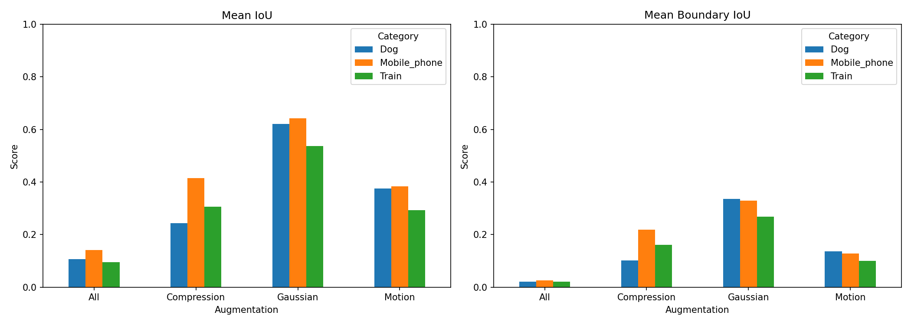

# Robustness of SAM Under Image Degradation

## Dataset
Images downloaded from Open Images V7 (Google) using Fiftyone. 

Catergories: Dog, Train, Mobile Phone - 40 images each.

Images are included in the repo under `/training_data/`.

### Open Images Dataset Downloader in Colab

## Image Degradation Script
The script we used to iterate over the dataset downloaded earlier is the following:
`/training_data/blurring.py`

We created 4 augmentations which all are identified by a python dictionary and all have their respective functions.

The augmentations:
- Gaussian Blur
- Motion Blur
- Image Compression
- All (All of the above)

Once the images are applied with their respective augmentation/degradation, they are saved to a folder containing all images from their category with that augmentation in this naming format:

output folders:
`
./Dog_Gaussian/          ./Dog_Motion/          ./Dog_Compression/
`
etc.

The files themselves are also named after their original name + the augmentation:
`
Dog_0001_Gaussian.jpg
`

Focusing on this early made the process of iteratively generating masks and comparing them to the original later on much easier.

## SAM Mask generation and comparison
The notebook used for the generation and comparison is the following:
`/SAM_COMPARISON.ipynb`

As we used _Google Colab_ to perform the actual generation and comparison we found using a notebook was required. The reasoning for using Colab was so that we did not have to run the SAM model locally as this would have taken much more time.

We chose three different metrics to compare the original vs the augmented images:
- Mean Intersect over Union
- Mean Boundary Intersect over Union
- Mean Mask Count Diff

These metrics were chosen because they each show a different way of how degradation affects the SAM model. IoU shows how much the masks overlap in general which is the main thing we wanted to test. Boundary IoU shows the difference in edges, which is what can be affected the most by blurs and compression. Mask count difference shows the difference in mask generation as a whole between the two images. 

We believe these metrics create a good overview of the effect of the degradation.

## AI Declaration
The notebook and blurring script was developed using the Claude LLM (Sonnet 4.6) in the form of design decisions and streamlining first the image degradation and then the generation/comparison. We made sure to fully understand all code before implementing it as we want this project to be our own product. Any functions/part of code that are originally created by the LLM are specified within the notebook/script, and have been modified by us.

More specifically the naming convention and file structure were developed with help from the LLM through prompting. Also the "visual sanity check" that provides a visual representation of original/augmented masks was developed with help from the LLM, mostly for debugging purposes.

## Results
We have uploaded the full list of masks (compressed folder): `training_data/masks.zip`, and the graphical results in the repository: `/results/results_plot.png`. We also have a CSV file with all the metrics in the results folder: `/results/results_list.csv`.

Graphical plot of the results:

